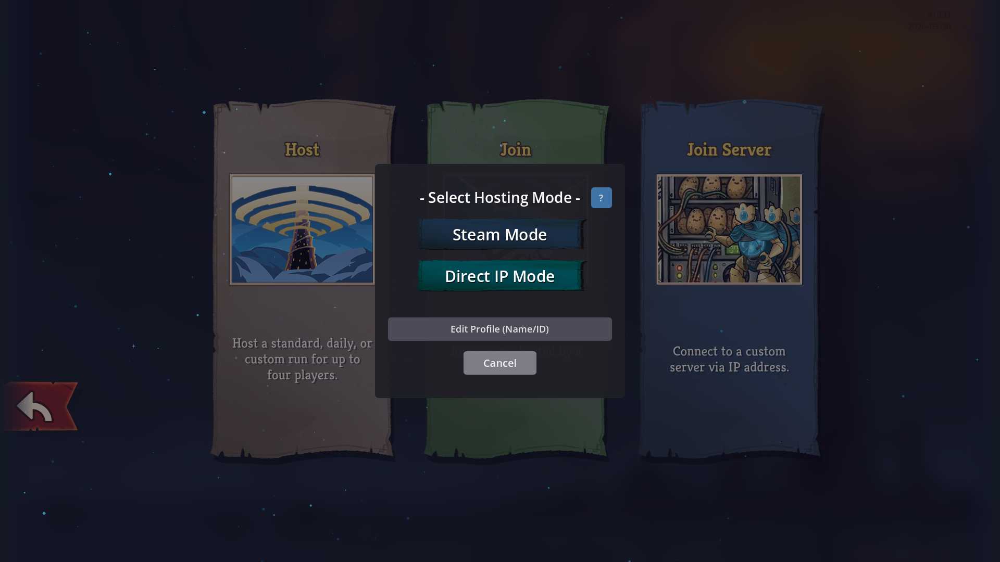
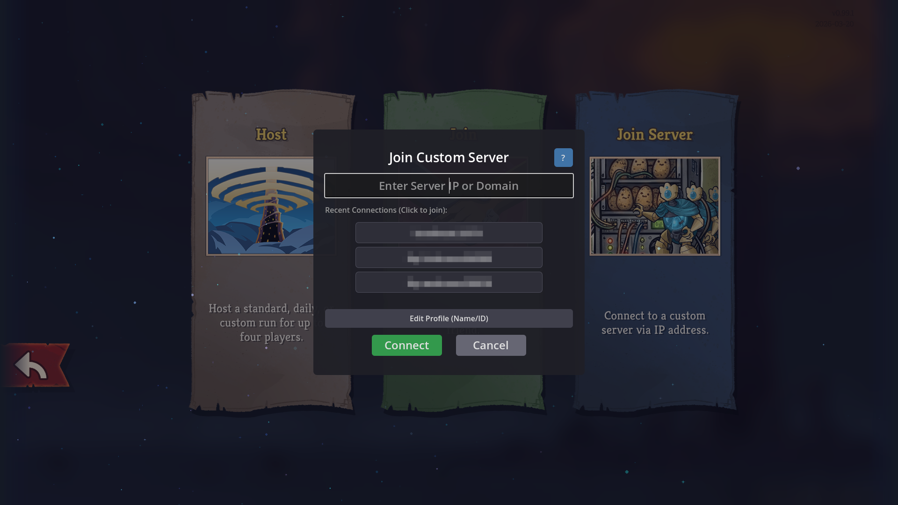
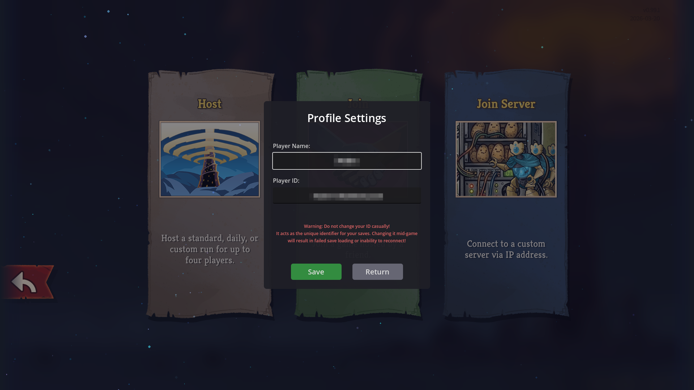

<div align="center">

# Slay the Spire 2 DirectConnectIP

[**中文**](README_CN.md) | [**Changelog**](Changelog.md)


*A direct IP multiplayer mod for Slay the Spire 2. Say goodbye to complex platform network issues and connect directly with your friends via IP address to climb the Spire together!*

</div>

---

This mod adds low-level Direct IP connection functionality to *Slay the Spire 2*. Whether you are on the same local network (LAN) or using tunneling tools, you can quickly connect by entering an IP address.

<br>

<div align="center">
  
  <br><br>
  
  <br><br>
  
</div>

<br>

---

## 🎀 Core Features

* **Direct IP Support:** Establish P2P or Client-Server connections directly via IPv4/IPv6 addresses (and ports).
* **Low-Latency Sync:** Designed for players with poor network environments or matchmaking difficulties, providing a more stable underlying connection.
* **Offline Player Takeover:** No need to restart if someone disconnects! The system will automatically take over the disconnected player's character until their network recovers and they reconnect.
* **Virtual LAN Friendly:** Perfectly compatible with various port forwarding and Virtual LAN (VLAN) tools.

---

## 🎮 Installation Guide

### Windows

1. Download the latest `sts2-DirectConnectIP-[version].zip` from the **Releases** page.
2. Extract the archive and copy the entire `DirectConnectIP` folder into your game's `<Slay the Spire 2>/mods/` directory.
3. Launch the game. The mod will be enabled automatically.

---

## ⚙️ Connection & Configuration

**As a Host:**
1. Click "Create Room" on the main menu, and a multiplayer mode selection will pop up.
2. If your friends are on an external network, share your **Public IP** (or VLAN IP) with them.
3. The default local listening port is **UDP 33771**.
4. Your Player Name and Player ID are inherited from Steam by default, but you can customize them in the mod's UI.

**As a Client:**
1. Click "Join Server" (or Join Room) on the main menu.
2. Enter the IP address provided by the host in the pop-up input box (e.g., `abc.example.com:9567` or `192.168.1.100:33771`).
3. Click Connect to enter the lobby. Upon successful connection, the IP will be saved automatically for a quick one-click connection next time.
4. Your Player Name and Player ID are inherited from Steam by default, but you can customize them in the mod's UI.

> **Tip:** The mod configuration is automatically saved to the Godot user directory at `user://mods/DirectConnectIP/config.ini`.

---

## 📝 Configuration File Example

```ini
# Profile Configuration
[Profile]

# Your Player Name
LocalPlayerName="YourPlayerName"
# Your Player ID (Network ID, serves as a unique identifier)
LocalPlayerId=123456

# Feature Settings
[Features]

# Enable offline player takeover mode (Default: true)
EnableOfflineTakeover=true
# Enable compatibility fix for unofficial Android ports (Default: true)
EnableAndroidCompatFix=true

# Successfully connected IP addresses (Used for history display only)
[ServerHistory]

Server0="localhost:33771"
Server1="mod.example.com:9567"
Server2="sts2.example.com:23333"

```

---

## ⌨️ Custom Commands

**The mod registers two commands that can be entered and used in the console (Not required, not recommended for regular players):**
1. `sethostmode (steam | enet | ip)`: Changes the host room creation mode (Deprecated).
2. `connect <ip> [port]`: Connects directly to the specified room via IP address.

---

## 📄 Open Source License & Copyright Statement (License)

This project is licensed under the **Creative Commons Attribution-NonCommercial 4.0 International (CC BY-NC 4.0)**.

* **Free to use and modify:** You can freely use, learn, and distribute the code of this project. **Other authors are highly encouraged and welcome to maintain and do secondary development based on this code.**
* **Attribution requirement:** When distributing, modifying, or doing secondary development based on this project, the original author's attribution must be retained.
* **Commercial authorization restrictions:** **It is strictly prohibited to use this project and its derivative versions for any form of commercial purposes without authorization** (including but not limited to: charging for profit, paid modpack sales, servers with forced sponsorship walls, etc.).

**Copyright and Commercial Authorization Application:**
The copyright of all core code of this project belongs to the original author. Unauthorized commercial behavior will be held legally responsible.
